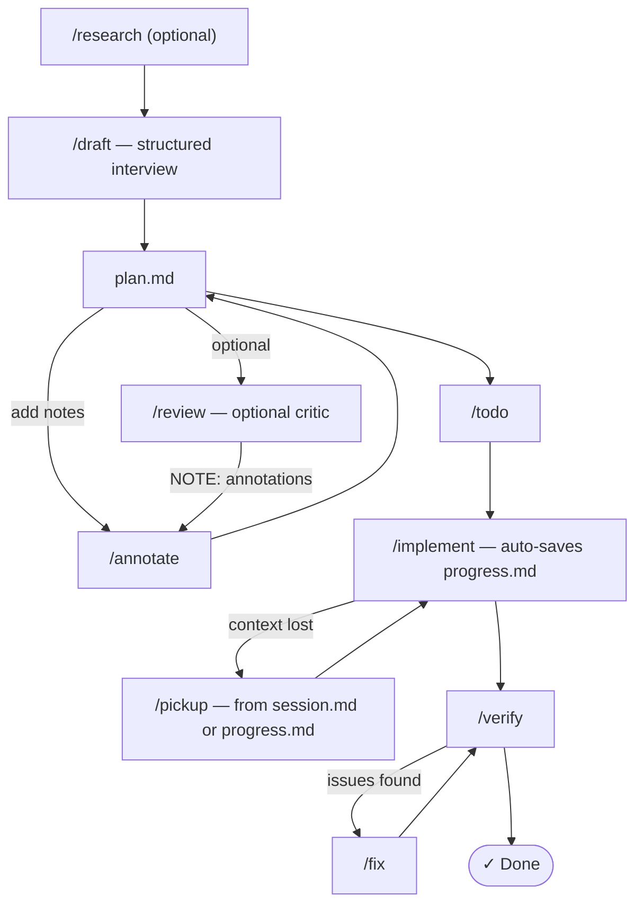

# Plan-Driven Development Commands for Claude Code

Slash commands for disciplined AI-assisted development. Drop into any existing codebase — no project setup required.

Inspired by [Boris Tane's workflow](https://boristane.com/blog/how-i-use-claude-code/) with practical additions (atomic commits, verification, session persistence) from [GSD](https://github.com/gsd-build/get-shit-done).

## Commands

| Command | What it does |
|---------|-------------|
| `/research <area>` | Deep-read codebase, write findings to `.claude-dev/research.md` (spawns Opus) |
| `/draft <feature>` | Structured interview scaled to task complexity, then write `.claude-dev/plan.md` (spawns Opus) |
| `/review` | Adversarial plan review — fresh Opus critic reads plan + source files, writes `.claude-dev/review.md` |
| `/annotate` | Process your inline notes in the plan, repeat until right |
| `/todo` | Add wave-based task checklist — independent tasks grouped for parallel execution |
| `/implement` | Execute the plan: parallel subagents per wave, atomic commits, auto-saves progress after each wave |
| `/park` | Save session state to `.claude-dev/session.md` — use when context is running out |
| `/pickup` | Recover from `session.md` (explicit park) or `progress.md` (auto-saved) — whichever is newer |
| `/verify` | Confirm the work is correct: automated checks + manual walkthrough |
| `/fix <issue>` | Investigate, fix, commit, and verify a specific issue found post-verify |
| `/cleanup` | Manual wipe of `.claude-dev/` (entry point auto-cleans) |

## The Flow

All working files live in `.claude-dev/` — auto-created and auto-gitignored on first run. `/research` automatically wipes previous files so each task starts with a clean slate.

```
/research <area>            → review .claude-dev/research.md
/draft <feature>            → structured interview, then review .claude-dev/plan.md
  (add inline notes)
/annotate                   → repeat until plan is right
/review                     → review .claude-dev/review.md, integrate findings via /annotate
/todo                       → review task breakdown
/implement                  → supervise, auto-saves .claude-dev/progress.md after each wave
  (if context runs out or is lost unexpectedly)
  /park                     → saves full state to .claude-dev/session.md
  (new session or lost context)
  /pickup                   → recovers from session.md or progress.md, whichever is newer
/verify                     → confirm it works
/fix <issue>                → fix issues, re-run /verify until clean
```



## Key Features

**Auto Opus for thinking** — `/research`, `/draft`, and `/review` automatically spawn an Opus subagent (`env -u CLAUDECODE claude -p --model claude-opus-4-6 --max-turns 25`) for the thinking-heavy work. Falls back to the current session model if Opus isn't available. Your main session stays lightweight.

**Auto feature branches** — `/implement` shows you the current branch and asks if you want to create a new one. If you mention a Jira ticket (e.g. `PROJ-123`), it uses that as the branch name: `feat/PROJ-123-short-description`.

**Parallel execution** — `/todo` groups tasks into waves based on dependencies. `/implement` runs independent tasks within each wave in parallel using subagents (Task tool), while waves run sequentially. A typical breakdown:
```
Wave 1 (parallel): Create migration, add types, write test stubs
Wave 2 (parallel): Implement service layer, implement API handler
Wave 3 (sequential): Integration wiring, final verification
```

**Structured interviews** — `/draft` assesses task complexity and scales the Q&A accordingly: small tasks (single file, bug fix) skip the interview entirely; medium tasks get 3–5 focused questions; large or cross-cutting features get a thorough interview covering architecture, scope, edge cases, testing, and deployment. Answers are saved to `.claude-dev/interview.md` and fed to Opus as explicit constraints.

**Adversarial plan review** — `/review` spawns a fresh Opus subagent as a critic. It reads your plan *and* the actual source files it references, checking for incorrect assumptions, missing edge cases, and better alternatives. You triage each finding (integrate / skip / discuss), and integrated items become `NOTE:` annotations for `/annotate` to process into the plan.

**Automatic context recovery** — `/implement` auto-saves a lightweight checkpoint to `.claude-dev/progress.md` after each completed wave. If context is lost unexpectedly (crash, `/compact`, token limit), `/pickup` recovers from the latest checkpoint automatically — no need to have explicitly run `/park`.

**Session persistence** — `/park` snapshots your current wave, git state, and uncommitted changes into `.claude-dev/session.md`. `/pickup` checks both `session.md` and `progress.md` and recovers from whichever is newer — no re-reading the whole plan, no re-doing completed work.

## Example: Adding Push Notifications to a React Native App

```
> /research the notification and messaging systems
```
Claude deep-reads your codebase — services, hooks, navigation, existing Firebase setup — and writes `.claude-dev/research.md` with findings like "FCM is initialized in `src/services/firebase.ts` but only used for analytics, no push token registration exists."

```
> /draft add push notifications that route users to the relevant screen when tapped
```
You review `.claude-dev/plan.md`. Claude proposes changes across `src/services/notifications.ts`, `src/hooks/useNotifications.ts`, `src/navigation/DeepLinkHandler.tsx`, and the native `AppDelegate.mm` / `AndroidManifest.xml`. Includes code snippets, verification steps like "send a test notification via Firebase console and confirm it opens the chat screen."

You open `.claude-dev/plan.md` in your editor and add notes:
- *"use notifee instead of react-native-push-notification — we already have it in package.json"*
- *"don't touch AppDelegate, we're using expo-notifications for the native layer"*
- *"remove the badge count section, not needed for v1"*

```
> /annotate
```
Claude processes all your notes, restructures the plan. You review again — looks good.

```
> /todo
```
Groups tasks into waves: Wave 1 (parallel) — register push token + create notification service + update backend schema. Wave 2 (parallel) — handle foreground notifications + handle background tap. Wave 3 (sequential) — deep link to correct screen + add preferences toggle.

```
> /implement
```
Claude creates a feature branch (`feat/push-notifications` or `feat/PROJ-456-push-notifications` if you mentioned a Jira ticket), then spawns parallel subagents for each wave — Wave 1 tasks run simultaneously, then Wave 2, etc. After each wave, runs `npx tsc --noEmit`, asks you to confirm any UI changes, then commits atomically (`feat(notifications): register FCM push token`, `feat(notifications): handle background tap deep linking`, etc.).

```
> /verify
```
Claude runs the type checker and tests, then walks you through: "Open the app on a physical device, send a test push from Firebase console, tap it — you should land on the chat screen for that conversation."

You notice tapping a notification while the app is foregrounded doesn't do anything:
```
> /fix tapping notification while app is in foreground doesn't navigate to the chat screen
```
Claude traces the issue to a missing foreground event handler in `useNotifications.ts`, fixes it, verifies the type checker passes, asks you to confirm the behavior, then commits `fix(notifications): handle foreground notification tap`.

## Installation

Copy into your project (local):
```bash
cp -r .claude/commands/ /path/to/your/project/.claude/commands/
```

Or install globally (all projects):
```bash
cp -r .claude/commands/ ~/.claude/commands/
```

The `.claude-dev/` working directory is created automatically on first use. Your project stays clean:
```
your-project/
├── .claude/commands/      ← the slash commands (committed)
├── .claude-dev/           ← auto-created, gitignored
│   ├── research.md
│   ├── interview.md       ← created by /draft (when task warrants questions)
│   ├── plan.md
│   ├── review.md          ← created by /review
│   ├── prompt.md
│   ├── progress.md        ← auto-saved by /implement after each wave
│   └── session.md         ← created by /park
├── .gitignore             ← .claude-dev/ added automatically
└── ...
```
